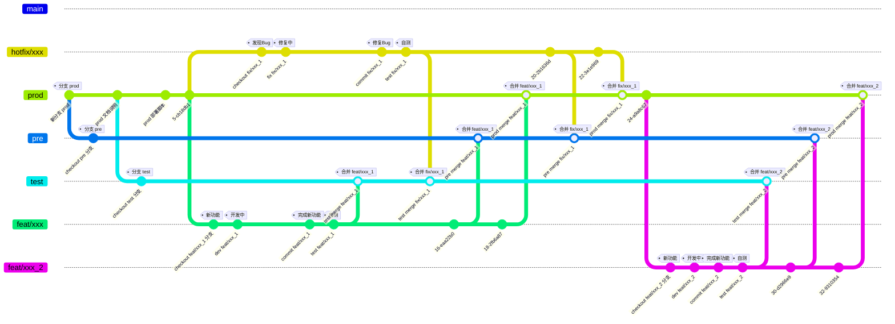

# git

```shell
git config user.email "ckaiguang@outlook.com"
git config user.name "ckaiguang"
```

# 协作流程

**Git协作流程**

- 分支 dev : gitlab-ci 自动部署到开发环境。代码合并流程同 test 分支。
    - 开发工程师自测与验证
- 分支 test : gitlab-ci 自动部署到测试环境。
    - 开发工程师自测与验收
    - 测试工程师测试与验收
- 分支 pre : 设置保护分支并 gitlab-ci 自动部署到预发布环境。
    - 测试工程师再次验收
    - 产品经理验收
    - 客户演示
- 分支 prod(main) : 设置保护分支，仅允许技术负责人和运维进行合并MR，自动部署到线上环境。
    - prod分支每次发布，增加一次tag标签。用于记录版本发布和服务回滚。



## Commit Message Format

**参考文档**

- [angular : Commit Message Format](https://github.com/angular/angular.js/blob/master/DEVELOPERS.md#commit-message-format)

Each commit message consists of a **header**, a **body** and a **footer**.  The header has a special format that includes a **type**, a **scope** and a **subject**:

```SQL
<type>(<scope>): <subject>
<BLANK LINE>
<body>
<BLANK LINE>
<footer>
```

The **header** is mandatory and the **scope** of the header is optional.

Any line of the commit message cannot be longer than 100 characters! This allows the message to be easier to read on GitHub as well as in various git tools.

### Type

Must be one of the following:

- **feat**: A new feature
- **fix**: A bug fix
- **docs**: Documentation only changes
- **style**: Changes that do not affect the meaning of the code (white-space, formatting, missing semi-colons, etc)
- **refactor**: A code change that neither fixes a bug nor adds a feature
- **perf**: A code change that improves performance
- **test**: Adding missing or correcting existing tests
- **chore**: Changes to the build process or auxiliary tools and libraries such as documentation generation
