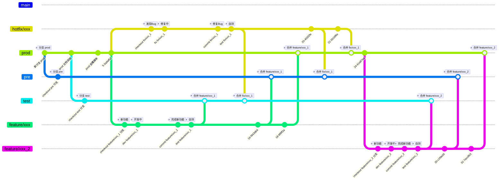

# Git 协作流程规范

参考文档：

* [angular : Commit Message Format](https://github.com/angular/angular.js/blob/master/DEVELOPERS.md#commit-message-format)

## Git 协作流程



## Commit Message Format - 提交消息格式

Each commit message consists of a **header**, a **body** and a **footer**.  The header has a special format that includes a **type**, a **scope** and a **subject**:

```txt
<type>(<scope>): <subject>
<BLANK LINE>
<body>
<BLANK LINE>
<footer>
```

The **header** is mandatory and the **scope** of the header is optional.

Any line of the commit message cannot be longer than 100 characters! This allows the message to be easier to read on GitHub as well as in various git tools.

### Type

Must be one of the following:

* **feat**: A new feature
* **fix**: A bug fix
* **docs**: Documentation only changes
* **style**: Changes that do not affect the meaning of the code (white-space, formatting, missing semi-colons, etc)
* **refactor**: A code change that neither fixes a bug nor adds a feature
* **perf**: A code change that improves performance
* **test**: Adding missing or correcting existing tests
* **chore**: Changes to the build process or auxiliary tools and libraries such as documentation generation
