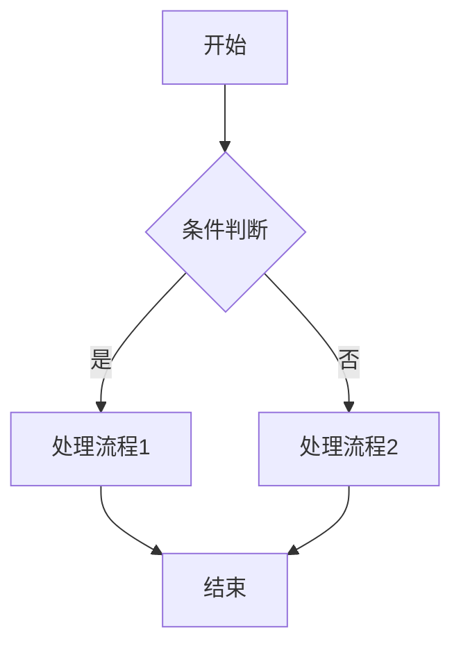
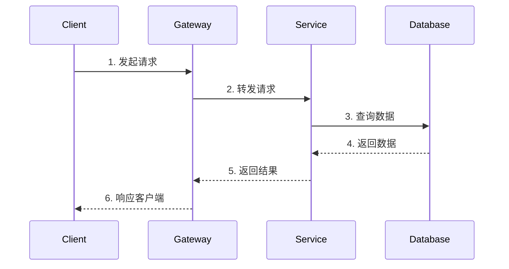
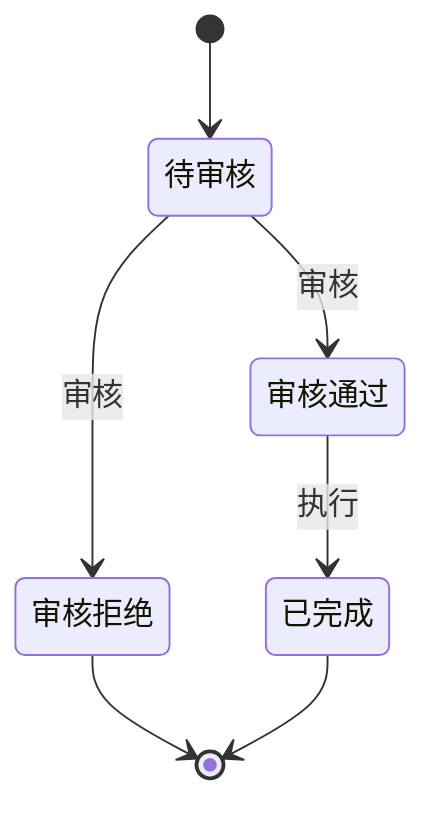
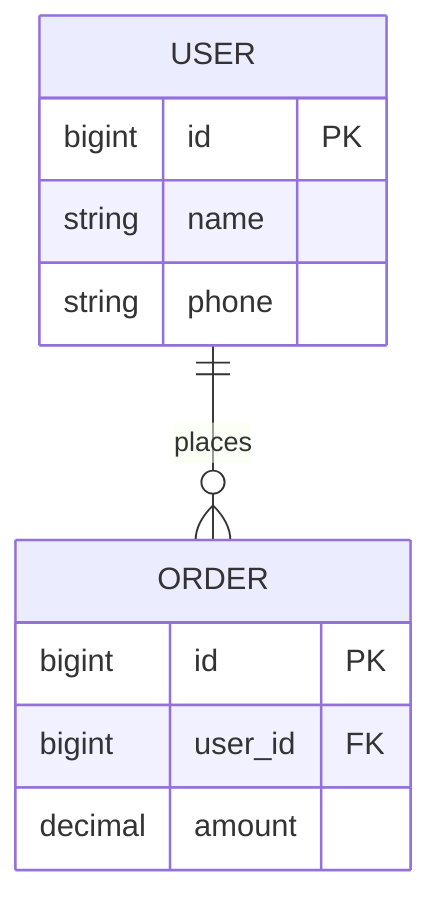
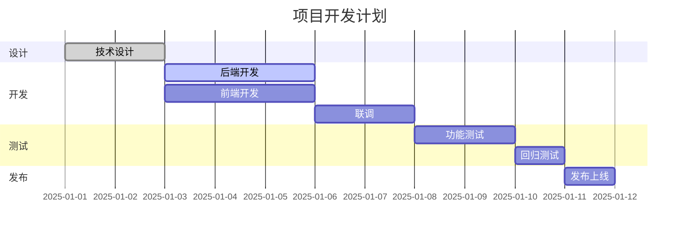

# 开发方案设计模版 v2.0

## 修订记录

| 时间 | 人员 | 内容 |
|------|------|------|
| 2025-04-27 | @陈开广 | 输出方案设计模版 |
| 2025-05-12 | @陈开广 | 增加需求目标说明 |
| 2025-xx-xx | @xxx | 完善模版结构，增加风险评估、测试方案、监控告警等章节 |

## 模版说明

1. 需求技术设计由当前功能需求版本研发负责人主导(前端/后端)，相关参与研发同学共同完成
2. 该文档作为技术设计参考文档，设计过程中可以根据实际需要进行增加或删除
3. **技术设计目标**：
   - 研发通过设计，明确功能用例，同时考虑需求的性能、扩展性、可用性、安全、部署等非功能用例
   - 通过设计文档 & 评审产研测达成需求理解一致
4. **评审检查清单**：
   - [ ] 需求理解是否一致
   - [ ] 技术方案是否可行
   - [ ] 风险是否已识别并有应对措施
   - [ ] 测试方案是否完整
   - [ ] 部署和回滚方案是否可执行

---

## 一、需求背景与目标

### 1.1 需求背景

描述需求的背景：
- **技术调研类**：简单描写调研背景与目标
- **产品需求类**：贴上产品的设计文档和背景描述

| 项目 | 内容 |
|------|------|
| 需求文档 | [需求文档链接](https://xxx) |
| PRD文档 | [PRD文档链接](https://xxx) |
| 原型设计 | [原型设计链接](https://xxx) |

### 1.2 需求目标

明确描述：
1. **实现什么功能**：具体功能点列表
2. **解决哪些痛点**：当前存在的问题及解决方案
3. **预期收益**：量化的业务指标或技术指标

### 1.3 术语定义

| 术语 | 定义 | 备注 |
|------|------|------|
| 术语1 | 定义说明 | - |
| 术语2 | 定义说明 | - |

---

## 二、功能调研与影响范围

### 2.1 后端模块

| 功能模块 | 描述 | 接口文档 | 变更类型 |
|---------|------|---------|---------|
| [模块名称] 子模块1 | 1. 模块功能1<br>2. 模块功能2 | [接口文档](https://xxx) | 新增/修改 |
| [模块名称] 子模块2 | 1. 模块功能1 | [接口文档](https://xxx) | 新增 |

### 2.2 前端模块

| 功能模块 | 描述 | 页面路由 | 变更类型 |
|---------|------|---------|---------|
| [模块名称] 子模块1 | 1. 页面功能1<br>2. 页面功能2 | /path/to/page | 新增/修改 |

### 2.3 第三方API接口

| 功能模块 | 描述 | 接口文档 | 调用频率限制 |
|---------|------|---------|-------------|
| [第三方服务名] | 功能描述 | [官方文档](https://xxx) | 100次/分钟 |

### 2.4 依赖服务

| 服务名称 | 负责团队 | 联系人 | 依赖说明 |
|---------|---------|--------|---------|
| 服务A | 团队X | @xxx | 需要调用xxx接口 |
| 服务B | 团队Y | @yyy | 需要订阅xxx消息 |

---

## 三、技术方案设计

### 3.1 技术选型

| 技术点 | 方案A | 方案B | 选择 | 选择理由 |
|-------|-------|-------|------|---------|
| 缓存方案 | Redis | 本地缓存 | Redis | 支持分布式，数据一致性好 |
| 消息队列 | RabbitMQ | Kafka | RabbitMQ | 现有基础设施，学习成本低 |

### 3.2 方案对比

| 对比维度 | 方案一：[方案名称] | 方案二：[方案名称] |
|---------|-------------------|-------------------|
| 方案描述 | 使用Redis缓存 + MySQL | 纯MySQL查询 |
| 优点 | 1. 减少数据库查询，增加QPS<br>2. 响应速度快 | 1. 实现简单<br>2. 数据一致性好 |
| 缺点 | 1. 存在缓存击穿问题<br>2. 需要维护缓存一致性 | 1. QPS受限<br>2. 数据库压力大 |
| 开发成本 | 中 | 低 |
| 维护成本 | 中 | 低 |
| 性能表现 | 高 | 中 |
| 扩展性 | 好 | 一般 |

**方案选择**：选择 **方案一**

**选择理由**：
1. 业务场景读多写少，缓存命中率高
2. 缓存击穿问题可通过预加载数据方案解决
3. 性能要求高，需要支持高并发访问

### 3.3 架构图

```
┌─────────────┐     ┌─────────────┐     ┌─────────────┐
│   Client    │────▶│   Gateway   │────▶│   Service   │
└─────────────┘     └─────────────┘     └─────────────┘
                                              │
                    ┌─────────────┐           │
                    │    Redis    │◀──────────┤
                    └─────────────┘           │
                                              ▼
                                        ┌─────────────┐
                                        │    MySQL    │
                                        └─────────────┘
```

### 3.4 流程图



### 3.5 时序图



### 3.6 状态机（如适用）



---

## 四、数据设计

### 4.1 数据库设计

#### 4.1.1 ER图



#### 4.1.2 表结构设计

**表名**：`testing.users`

| 字段名 | 类型 | 是否必填 | 默认值 | 说明 |
|-------|------|---------|--------|------|
| id | BIGINT | 是 | AUTO_INCREMENT | 主键 |
| name | VARCHAR(255) | 是 | '' | 用户名 |
| phone | VARCHAR(20) | 否 | '' | 手机号 |
| created_at | DATETIME | 是 | CURRENT_TIMESTAMP | 创建时间 |
| updated_at | DATETIME | 是 | CURRENT_TIMESTAMP | 更新时间 |

**DDL语句**：

```sql
CREATE TABLE `users` (
    `id` BIGINT AUTO_INCREMENT,
    `name` VARCHAR(255) NOT NULL DEFAULT '' COMMENT '用户名',
    `phone` VARCHAR(20) NOT NULL DEFAULT '' COMMENT '手机号',
    `created_at` DATETIME NOT NULL DEFAULT CURRENT_TIMESTAMP COMMENT '创建时间',
    `updated_at` DATETIME NOT NULL DEFAULT CURRENT_TIMESTAMP ON UPDATE CURRENT_TIMESTAMP COMMENT '更新时间',
    PRIMARY KEY (`id`),
    INDEX `idx_phone` (`phone`)
) ENGINE=InnoDB DEFAULT CHARSET=utf8mb4 COMMENT='用户表';
```

#### 4.1.3 索引设计

| 表名 | 索引名 | 索引字段 | 索引类型 | 用途说明 |
|------|--------|---------|---------|---------|
| users | idx_phone | phone | BTREE | 手机号查询 |

### 4.2 缓存设计

| Key格式 | Value类型 | 过期时间 | 用途 | 更新策略 |
|---------|----------|---------|------|---------|
| `user:{uid}` | Hash | 24h | 用户信息缓存 | 写时更新 |
| `user:list:{page}` | String(JSON) | 5min | 用户列表缓存 | 定时刷新 |

**缓存预热脚本**：

```bash
# Redis预热命令
SET user:config:xxx "value" EX 86400
```

### 4.3 消息队列设计

| Topic名称 | 用途 | 消息格式 | 消费者 | 备注 |
|----------|------|---------|--------|------|
| kasa_user_created | 用户创建事件 | JSON | 通知服务、统计服务 | 需要幂等处理 |

**消息体示例**：

```json
{
    "event_type": "user_created",
    "timestamp": "2025-01-01T00:00:00Z",
    "data": {
        "user_id": 123,
        "name": "张三"
    }
}
```

---

## 五、接口设计

### 5.1 接口列表

| 接口名称 | 请求方式 | 路径 | 说明 |
|---------|---------|------|------|
| 创建用户 | POST | /api/v1/user/create | 创建新用户 |
| 查询用户 | GET | /api/v1/user/{id} | 根据ID查询用户 |

### 5.2 接口详情

#### 5.2.1 创建用户

**基本信息**：

| 项目 | 内容 |
|------|------|
| 请求方式 | POST |
| 请求路径 | /api/v1/user/create |
| Content-Type | application/json |
| 是否需要鉴权 | 是 |

**请求头**：

| 参数名 | 类型 | 必填 | 说明 |
|-------|------|------|------|
| Authorization | string | 是 | Bearer Token |

**请求参数**：

| 参数名 | 类型 | 必填 | 说明 | 示例 |
|-------|------|------|------|------|
| name | string | 是 | 用户名，长度2-50 | "张三" |
| phone | string | 是 | 手机号，11位数字 | "13800138000" |

**请求示例**：

```json
{
    "name": "张三",
    "phone": "13800138000"
}
```

**响应参数**：

| 参数名 | 类型 | 说明 |
|-------|------|------|
| code | int | 状态码 |
| reason | string | 错误原因 |
| message | string | 提示信息 |
| data | object | 响应数据 |
| data.uid | int | 用户ID |
| data.name | string | 用户名 |
| data.phone | string | 脱敏手机号 |

**响应示例**：

```json
{
    "code": 200,
    "reason": "OK",
    "message": "创建成功",
    "data": {
        "uid": 123,
        "name": "张三",
        "phone": "138****8000"
    }
}
```

**错误码**：

| 错误码 | reason | 说明 | 处理建议 |
|-------|--------|------|---------|
| 200 | OK | 成功 | - |
| 400 | INVALID_PARAM | 参数错误 | 检查请求参数 |
| 401 | UNAUTHORIZED | 未授权 | 检查Token |
| 403 | FORBIDDEN | 无权限 | 联系管理员 |
| 500 | INTERNAL_ERROR | 服务器错误 | 联系开发人员 |

### 5.3 Protobuf定义（如使用gRPC）

```protobuf
// 创建用户请求
message CreateUserReq {
    int64 operator_uid = 100;  // 操作人UID
    
    string name  = 1;  // 用户名
    string phone = 2;  // 手机号
}

// 创建用户响应
message CreateUserResp {
    int32 code                   = 1;
    string reason                = 2;
    string message               = 3;
    map<string, string> metadata = 4;
    
    CreateUserRespData data = 100;
}

message CreateUserRespData {
    int64 uid    = 1;  // 用户ID
    string name  = 2;  // 用户名
    string phone = 3;  // 脱敏手机号
}

service UserService {
    rpc CreateUser(CreateUserReq) returns (CreateUserResp) {
        option (google.api.http) = {
            post: "/api/v1/user/create"
            body: "*"
        };
    }
}
```

---

## 六、非功能需求

### 6.1 安全需求

| 安全项 | 风险描述 | 防护措施 |
|-------|---------|---------|
| XSS攻击 | 用户输入可能包含恶意脚本 | 输入过滤、输出转义 |
| CSRF攻击 | 跨站请求伪造 | Token验证 |
| SQL注入 | 恶意SQL语句 | 参数化查询、ORM |
| 敏感数据 | 手机号、身份证等泄露 | 脱敏展示、加密存储 |
| 接口安全 | 未授权访问 | JWT鉴权、权限校验 |

### 6.2 性能需求

| 指标 | 目标值 | 测试方法 |
|------|--------|---------|
| 接口响应时间(P99) | < 200ms | 压测 |
| QPS | > 1000 | 压测 |
| 并发用户数 | > 500 | 压测 |
| 数据库查询时间 | < 50ms | 慢查询日志 |

**性能优化措施**：
1. 使用Redis缓存热点数据
2. 数据库添加合适索引
3. 接口响应数据分页
4. 异步处理非关键路径

### 6.3 可用性需求

| 指标 | 目标值 | 保障措施 |
|------|--------|---------|
| 服务可用性 | 99.9% | 多实例部署、健康检查 |
| 故障恢复时间 | < 5min | 自动重启、告警通知 |

### 6.4 扩展性需求

1. **水平扩展**：服务无状态设计，支持多实例部署
2. **功能扩展**：预留扩展字段，使用策略模式
3. **数据扩展**：分库分表预案

### 6.5 兼容性需求

| 兼容项 | 说明 | 处理方案 |
|-------|------|---------|
| 接口版本 | 新旧版本并存 | URL版本号(/v1/, /v2/) |
| 数据兼容 | 新增字段 | 设置默认值，不删除旧字段 |
| 客户端兼容 | 旧版本APP | 保持旧接口可用 |

---

## 七、测试方案

### 7.1 测试范围

| 测试类型 | 测试内容 | 负责人 |
|---------|---------|--------|
| 单元测试 | 核心业务逻辑 | 开发 |
| 接口测试 | API接口功能 | 测试 |
| 集成测试 | 服务间调用 | 测试 |
| 性能测试 | 压力测试、负载测试 | 测试 |
| 安全测试 | 漏洞扫描 | 安全团队 |

### 7.2 测试用例

| 用例编号 | 测试场景 | 输入 | 预期结果 | 优先级 |
|---------|---------|------|---------|--------|
| TC001 | 正常创建用户 | 有效参数 | 创建成功 | P0 |
| TC002 | 手机号格式错误 | 无效手机号 | 返回参数错误 | P1 |
| TC003 | 重复创建用户 | 已存在手机号 | 返回用户已存在 | P1 |

### 7.3 测试环境

| 环境 | 地址 | 用途 |
|------|------|------|
| 测试环境 | https://test.xxx.com | 功能测试 |
| 预发布环境 | https://pre.xxx.com | 回归测试 |

---

## 八、监控告警

### 8.1 监控指标

| 指标名称 | 指标类型 | 采集方式 | 告警阈值 |
|---------|---------|---------|---------|
| 接口响应时间 | Histogram | Prometheus | P99 > 500ms |
| 接口错误率 | Counter | Prometheus | > 1% |
| 服务CPU使用率 | Gauge | Node Exporter | > 80% |
| 服务内存使用率 | Gauge | Node Exporter | > 80% |

### 8.2 告警规则

| 告警名称 | 告警条件 | 告警级别 | 通知方式 |
|---------|---------|---------|---------|
| 接口响应慢 | P99 > 500ms 持续5分钟 | Warning | 飞书 |
| 接口错误率高 | 错误率 > 5% 持续3分钟 | Critical | 飞书+电话 |
| 服务不可用 | 健康检查失败 | Critical | 飞书+电话 |

### 8.3 日志规范

| 日志级别 | 使用场景 | 示例 |
|---------|---------|------|
| DEBUG | 调试信息 | 请求参数、中间变量 |
| INFO | 正常业务流程 | 用户登录、订单创建 |
| WARN | 可恢复的异常 | 重试成功、降级处理 |
| ERROR | 需要关注的错误 | 接口调用失败、数据异常 |

---

## 九、风险评估

### 9.1 风险识别

| 风险编号 | 风险描述 | 风险等级 | 发生概率 | 影响程度 |
|---------|---------|---------|---------|---------|
| R001 | 第三方接口不稳定 | 高 | 中 | 高 |
| R002 | 数据迁移失败 | 中 | 低 | 高 |
| R003 | 性能不达标 | 中 | 中 | 中 |

### 9.2 风险应对

| 风险编号 | 应对措施 | 负责人 | 预案 |
|---------|---------|--------|------|
| R001 | 增加重试机制、熔断降级 | @xxx | 降级返回缓存数据 |
| R002 | 分批迁移、备份数据 | @xxx | 回滚脚本 |
| R003 | 提前压测、优化代码 | @xxx | 增加服务器资源 |

---

## 十、部署方案

### 10.1 服务配置

**配置文件变更**：`config.yaml`

```yaml
# 新增配置项
oss:
  endpoint: https://xxx.com
  access_key: ${OSS_ACCESS_KEY}
  secret_key: ${OSS_SECRET_KEY}
```

### 10.2 数据迁移

**迁移脚本**：

```sql
-- 1. 添加新字段
ALTER TABLE `sys_users`
    ADD COLUMN `user_avatar` VARCHAR(255) NOT NULL DEFAULT '' COMMENT '头像' AFTER `nick_name`;

-- 2. 数据初始化
UPDATE `sys_users` SET `user_avatar` = 'default.png' WHERE `user_avatar` = '';
```

**注意事项**：
- [ ] 迁移脚本已在测试环境验证
- [ ] 已备份生产数据
- [ ] 迁移脚本已提交到代码仓库

### 10.3 部署顺序

```
1. 数据库迁移 → 2. 后端服务发布 → 3. 前端CDN发布
```

### 10.4 发布清单

| 服务 | 仓库地址 | 分支/Tag | 测试环境 | 预发布 | 生产环境 | 备注 |
|------|---------|---------|---------|--------|---------|------|
| GvaAsaBackend | [仓库链接](https://gitlab.xxx) | v1.18.17 | [ ] | [ ] | [ ] | 需先执行数据迁移 |
| GvaAsaFrontend | [仓库链接](https://gitlab.xxx) | v1.18.17 | [ ] | [ ] | [ ] | - |

### 10.5 回滚方案

**回滚顺序**：前端回滚 → 后端回滚 → 数据库回滚

#### 数据库回滚

```sql
-- 删除新增字段
ALTER TABLE `sys_users` DROP COLUMN `user_avatar`;
```

#### 服务回滚

| 服务 | 回滚版本 | Pipeline链接 |
|------|---------|-------------|
| GvaAsaBackend | v1.18.16 | [Pipeline](https://gitlab.xxx) |
| GvaAsaFrontend | v1.18.16 | [Pipeline](https://gitlab.xxx) |

---

## 十一、开发计划

### 11.1 任务分解

#### 后端开发

| 任务 | 工时 | 负责人 | 依赖 | 备注 |
|------|------|--------|------|------|
| 数据库设计 | 2h | @xxx | - | - |
| 接口开发 | 8h | @xxx | 数据库设计 | - |
| 单元测试 | 4h | @xxx | 接口开发 | - |
| 联调 | 4h | @xxx | 前端完成 | 需要@yyy配合 |

#### 前端开发

| 任务 | 工时 | 负责人 | 依赖 | 备注 |
|------|------|--------|------|------|
| 页面开发 | 8h | @yyy | - | - |
| 接口对接 | 4h | @yyy | 后端接口 | - |
| 联调 | 4h | @yyy | 后端完成 | - |

#### 测试验证

| 任务 | 工时 | 负责人 | 依赖 | 备注 |
|------|------|--------|------|------|
| 测试用例编写 | 4h | @zzz | 需求评审 | - |
| 功能测试 | 8h | @zzz | 联调完成 | - |
| 回归测试 | 4h | @zzz | 功能测试 | - |

### 11.2 里程碑

| 阶段 | 负责人 | 开始时间 | 结束时间 | 交付物 |
|------|--------|---------|---------|--------|
| 技术设计 | @xxx | 2025-01-01 | 2025-01-02 | 设计文档 |
| 开发联调 | @xxx/@yyy | 2025-01-03 | 2025-01-06 | 可测试版本 |
| 测试验证 | @zzz | 2025-01-07 | 2025-01-08 | 测试报告 |
| 发布上线 | @xxx | 2025-01-09 | 2025-01-09 | 生产环境 |

### 11.3 甘特图



---

## 附录

### A. 参考文档

| 文档名称 | 链接 |
|---------|------|
| 产品需求文档 | [链接](https://xxx) |
| 接口文档 | [链接](https://xxx) |
| 相关技术文档 | [链接](https://xxx) |

### B. 变更记录

| 版本 | 日期 | 变更内容 | 变更人 |
|------|------|---------|--------|
| v1.0 | 2025-01-01 | 初稿 | @xxx |
| v1.1 | 2025-01-02 | 增加xxx | @xxx |
