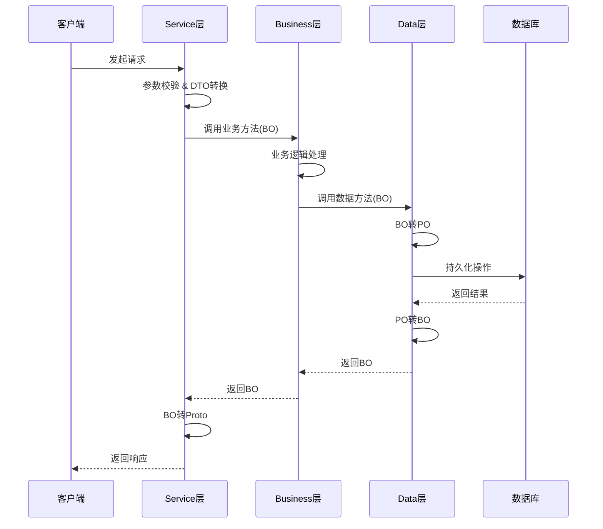
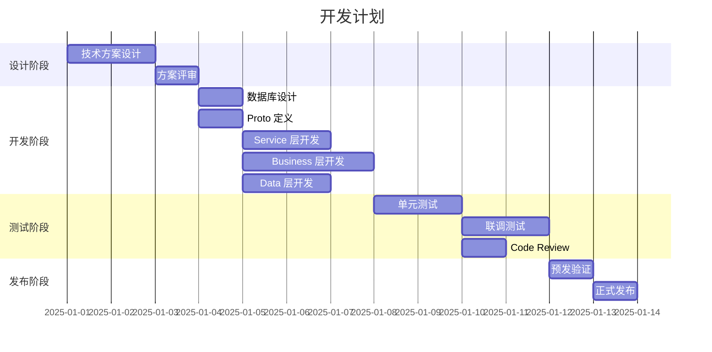

# 开发方案设计模版 v3.0

## 修订记录

| 时间         | 人员   | 内容                                                                 |
|------------|------|--------------------------------------------------------------------|
| 2025-04-27 | @陈开广 | 输出方案设计模版                                                           |
| 2025-05-12 | @陈开广 | 增加需求目标说明                                                           |
| 2025-06-15 | @陈开广 | 完善模版结构，增加风险评估、测试方案、监控告警等章节                                         |
| 2025-07-26 | @陈开广 | v3.0：增加数据流转、并发/幂等、一致性、灰度发布、权限设计、Code Review 检查清单等章节；优化 Protobuf 规范 |

## 模版说明

1. 需求技术设计由当前功能需求版本研发负责人主导(前端/后端)，相关参与研发同学共同完成
2. 该文档作为技术设计参考文档，设计过程中可以根据实际需要进行增加或删除
3. **技术设计目标**：
    - 研发通过设计，明确功能用例，同时考虑需求的性能、扩展性、可用性、安全、部署等非功能用例
    - 通过设计文档 & 评审产研测达成需求理解一致
4. **评审检查清单**：
    - [ ] 需求理解是否一致
    - [ ] 技术方案是否可行
    - [ ] 数据流转是否清晰（Proto → DTO → BO → PO → Database）
    - [ ] 并发与幂等是否已考虑
    - [ ] 数据一致性方案是否合理
    - [ ] 权限控制是否完整
    - [ ] 风险是否已识别并有应对措施
    - [ ] 测试方案是否完整（含边界条件和异常场景）
    - [ ] 部署和回滚方案是否可执行
    - [ ] 监控告警是否覆盖业务指标

---

## 一、需求背景与目标

### 1.1 需求背景

描述需求的背景：

- **技术调研类**：简单描写调研背景与目标
- **产品需求类**：贴上产品的设计文档和背景描述

| 项目    | 内容                     |
|-------|------------------------|
| 需求文档  | [需求文档链接](https://xxx)  |
| PRD文档 | [PRD文档链接](https://xxx) |
| 原型设计  | [原型设计链接](https://xxx)  |

### 1.2 需求目标

明确描述：

1. **实现什么功能**：具体功能点列表
2. **解决哪些痛点**：当前存在的问题及解决方案
3. **预期收益**：量化的业务指标或技术指标

### 1.3 术语定义

| 术语  | 定义   | 备注 |
|-----|------|----|
| 术语1 | 定义说明 | -  |
| 术语2 | 定义说明 | -  |

### 1.4 约束与限制

| 约束类型 | 描述                     | 影响        |
|------|------------------------|-----------|
| 时间约束 | 需在 xx 日期前上线            | 功能范围可能裁剪  |
| 技术约束 | 必须使用现有技术栈（Go + Kratos） | 不引入新框架    |
| 业务约束 | 需兼容旧版本客户端              | 接口不能破坏性变更 |
| 资源约束 | 仅 2 名后端开发              | 需合理拆分任务   |

---

## 二、功能调研与影响范围

### 2.1 后端模块

| 功能模块        | 描述                   | 接口文档                | 变更类型  | 影响范围    |
|-------------|----------------------|---------------------|-------|---------|
| [模块名称] 子模块1 | 1. 模块功能1<br>2. 模块功能2 | [接口文档](https://xxx) | 新增/修改 | 仅本服务    |
| [模块名称] 子模块2 | 1. 模块功能1             | [接口文档](https://xxx) | 新增    | 影响下游服务A |

### 2.2 前端模块

| 功能模块        | 描述                   | 页面路由          | 变更类型  |
|-------------|----------------------|---------------|-------|
| [模块名称] 子模块1 | 1. 页面功能1<br>2. 页面功能2 | /path/to/page | 新增/修改 |

### 2.3 第三方API接口

| 功能模块     | 描述   | 接口文档                | 调用频率限制  | 降级方案   |
|----------|------|---------------------|---------|--------|
| [第三方服务名] | 功能描述 | [官方文档](https://xxx) | 100次/分钟 | 返回缓存数据 |

### 2.4 依赖服务

| 服务名称 | 负责团队 | 联系人  | 依赖说明      | SLA   |
|------|------|------|-----------|-------|
| 服务A  | 团队X  | @xxx | 需要调用xxx接口 | 99.9% |
| 服务B  | 团队Y  | @yyy | 需要订阅xxx消息 | 99.9% |

---

## 三、技术方案设计

### 3.1 技术选型

| 技术   | 选型               | 版本      | 说明        |
|------|------------------|---------|-----------|
| 框架   | Kratos           | v2.9.1  | 微服务框架     |
| ORM  | GORM             | v1.25.x | 数据库 ORM   |
| 缓存   | Redis            | v7.x    | 缓存 & 分布式锁 |
| 消息队列 | RabbitMQ         | v3.x    | 异步消息处理    |
| 数据库  | MySQL/PostgreSQL | -       | 持久化存储     |

### 3.2 整体方案概述

简要描述技术方案的整体思路，包括：

1. 核心设计思想
2. 关键技术决策及理由
3. 与现有系统的集成方式

### 3.3 架构图

```
┌─────────────────────────────────────────────┐
│                   客户端                      │
└─────────────────┬───────────────────────────┘
                  │ HTTP / gRPC
┌─────────────────▼───────────────────────────┐
│              API Gateway                     │
│         (路由、鉴权、限流)                     │
└─────────────────┬───────────────────────────┘
                  │
┌─────────────────▼───────────────────────────┐
│           Service Layer (服务层)              │
│     HTTP/gRPC Handler + DTO 转换             │
└─────────────────┬───────────────────────────┘
                  │
┌─────────────────▼───────────────────────────┐
│          Business Layer (业务层)              │
│        业务逻辑 + BO 对象                     │
└─────────────────┬───────────────────────────┘
                  │
┌─────────────────▼───────────────────────────┐
│            Data Layer (数据层)                │
│     数据访问 + PO 对象 + 缓存                 │
└─────────────────┬───────────────────────────┘
                  │
┌─────────────────▼───────────────────────────┐
│         MySQL / Redis / MQ / ...             │
└─────────────────────────────────────────────┘
```

### 3.4 数据流转（DDD 分层）

描述数据在各层之间的转换关系：

```
Proto (API 定义)
  ↓ service 层：ToBoXxx()
DTO (service/dto/)
  ↓ service 层转换
BO (biz/bo/)
  ↓ data 层：ToPoXxx()
PO (data/po/)
  ↓ GORM
Database
```

**层级说明：**

| 层级         | 对象类型          | 所在目录                    | 职责                   | 示例                  |
|------------|---------------|-------------------------|----------------------|---------------------|
| API 层      | Proto Message | `api/xxx/v1/`           | 定义接口请求/响应结构          | `CreateUserRequest` |
| Service 层  | DTO           | `internal/service/dto/` | 接口参数校验、Proto 与 BO 转换 | `CreateUserDTO`     |
| Business 层 | BO            | `internal/biz/bo/`      | 业务逻辑对象，承载业务规则        | `UserBO`            |
| Data 层     | PO            | `internal/data/po/`     | 持久化对象，映射数据库表结构       | `UserPO`            |

**转换函数命名规范：**

| 转换方向       | 命名规范             | 所在层       | 示例                         |
|------------|------------------|-----------|----------------------------|
| Proto → BO | `ToBo{Xxx}()`    | Service 层 | `ToBoCreateUserParam(req)` |
| BO → Proto | `ToProto{Xxx}()` | Service 层 | `ToProtoUserInfo(bo)`      |
| BO → PO    | `ToPo{Xxx}()`    | Data 层    | `ToPoUser(bo)`             |
| PO → BO    | `ToBo{Xxx}()`    | Data 层    | `ToBoUser(po)`             |

### 3.5 流程图

使用 Mermaid 或其他工具绘制核心业务流程：


```mermaid
sequenceDiagram
    participant C as 客户端
    participant S as Service层
    participant B as Business层
    participant D as Data层
    participant DB as 数据库

    C->>S: 发起请求
    S->>S: 参数校验 & DTO转换
    S->>B: 调用业务方法(BO)
    B->>B: 业务逻辑处理
    B->>D: 调用数据方法(BO)
    D->>D: BO转PO
    D->>DB: 持久化操作
    DB-->>D: 返回结果
    D->>D: PO转BO
    D-->>B: 返回BO
    B-->>S: 返回BO
    S->>S: BO转Proto
    S-->>C: 返回响应
```

### 3.6 核心代码设计

描述核心模块的代码结构设计：

```
internal/
├── service/           # Service 层
│   ├── service/       # HTTP/gRPC Handler
│   │   └── xxx.service.go
│   └── dto/           # 数据传输对象
│       └── xxx.dto.go
├── biz/               # Business 层
│   ├── biz/           # 业务逻辑
│   │   └── xxx.biz.go
│   ├── bo/            # 业务对象
│   │   └── xxx.bo.go
│   └── repo/          # Repository 接口定义
│       └── xxx.repo.go
└── data/              # Data 层
    ├── data/          # 数据访问实现
    │   └── xxx.data.go
    ├── po/            # 持久化对象
    │   └── xxx.po.go
    └── repo/          # Repository 接口实现
        └── xxx.repo.go
```

### 3.7 关键设计决策

| 决策点   | 可选方案                        | 最终选择        | 理由          |
|-------|-----------------------------|-------------|-------------|
| 缓存策略  | Cache Aside / Write Through | Cache Aside | 读多写少场景，实现简单 |
| ID 生成 | UUID / Snowflake / 自增       | Snowflake   | 分布式环境，有序且唯一 |
| 消息队列  | Kafka / RabbitMQ            | RabbitMQ    | 现有基础设施，团队熟悉 |

### 3.8 并发与幂等设计

#### 3.8.1 并发控制

| 场景   | 并发风险      | 控制方案       | 实现方式                               |
|------|-----------|------------|------------------------------------|
| 用户注册 | 同一手机号并发注册 | 分布式锁       | Redis `SET NX` + 过期时间              |
| 库存扣减 | 超卖        | 乐观锁        | `UPDATE ... WHERE stock >= amount` |
| 订单创建 | 重复创建      | 唯一索引 + 幂等键 | MySQL 唯一索引                         |
| 配置更新 | 并发覆盖      | 版本号控制      | `UPDATE ... WHERE version = ?`     |

#### 3.8.2 幂等设计

| 接口   | 幂等键                  | 幂等窗口 | 实现方式                 |
|------|----------------------|------|----------------------|
| 创建订单 | `user_id + order_no` | 24小时 | Redis `SETNX` + 唯一索引 |
| 支付回调 | `payment_id`         | 永久   | 数据库唯一索引              |
| 发送通知 | `biz_type + biz_id`  | 1小时  | Redis `SETNX`        |

### 3.9 数据一致性方案

**缓存与数据库一致性：**

| 策略            | 适用场景  | 实现方式            | 一致性级别 |
|---------------|-------|-----------------|-------|
| Cache Aside   | 读多写少  | 先更新DB，再删除缓存     | 最终一致  |
| Write Through | 写入频繁  | 同时更新DB和缓存       | 强一致   |
| 延迟双删          | 高并发读写 | 删缓存→更新DB→延迟再删缓存 | 最终一致  |

**分布式事务：**

| 场景    | 事务方案  | 实现方式                 | 说明          |
|-------|-------|----------------------|-------------|
| 跨服务调用 | Saga  | 补偿事务 + 消息队列          | 最终一致性，适合长事务 |
| 单服务多表 | 数据库事务 | GORM `Transaction()` | 强一致性，适合短事务  |

---

## 四、数据设计

### 4.1 数据库设计

#### 4.1.1 ER 图

```
┌──────────────┐     ┌──────────────┐
│    users     │     │   orders     │
├──────────────┤     ├──────────────┤
│ id (PK)      │────<│ id (PK)      │
│ username     │     │ user_id (FK) │
│ email        │     │ order_no     │
│ phone        │     │ status       │
│ status       │     │ total_amount │
│ created_at   │     │ created_at   │
│ updated_at   │     │ updated_at   │
│ deleted_at   │     │ deleted_at   │
└──────────────┘     └──────────────┘
```

#### 4.1.2 表结构设计

```sql
-- 用户表
CREATE TABLE `users`
(
    `id`         BIGINT UNSIGNED NOT NULL AUTO_INCREMENT COMMENT '主键ID',
    `username`   VARCHAR(64)  NOT NULL DEFAULT '' COMMENT '用户名',
    `email`      VARCHAR(128) NOT NULL DEFAULT '' COMMENT '邮箱',
    `phone`      VARCHAR(20)  NOT NULL DEFAULT '' COMMENT '手机号',
    `password`   VARCHAR(128) NOT NULL DEFAULT '' COMMENT '密码（加密存储）',
    `status`     TINYINT      NOT NULL DEFAULT 1 COMMENT '状态：1-正常 2-禁用',
    `created_at` TIMESTAMP    NOT NULL DEFAULT CURRENT_TIMESTAMP COMMENT '创建时间',
    `updated_at` TIMESTAMP    NOT NULL DEFAULT CURRENT_TIMESTAMP ON UPDATE CURRENT_TIMESTAMP COMMENT '更新时间',
    `deleted_at` TIMESTAMP NULL DEFAULT NULL COMMENT '删除时间（软删除）',
    PRIMARY KEY (`id`),
    UNIQUE KEY `uk_phone` (`phone`),
    UNIQUE KEY `uk_email` (`email`),
    KEY          `idx_created_at` (`created_at`)
) ENGINE=InnoDB DEFAULT CHARSET=utf8mb4 COMMENT='用户表';
```

#### 4.1.3 索引设计

| 表名     | 索引名            | 索引类型   | 字段         | 用途      |
|--------|----------------|--------|------------|---------|
| users  | uk_phone       | UNIQUE | phone      | 手机号唯一约束 |
| users  | uk_email       | UNIQUE | email      | 邮箱唯一约束  |
| users  | idx_created_at | INDEX  | created_at | 按创建时间查询 |
| orders | uk_order_no    | UNIQUE | order_no   | 订单号唯一约束 |
| orders | idx_user_id    | INDEX  | user_id    | 按用户查询订单 |

### 4.2 缓存设计

| 缓存Key                  | 数据类型   | 过期时间 | 更新策略        | 说明         |
|------------------------|--------|------|-------------|------------|
| `user:{id}`            | Hash   | 30分钟 | Cache Aside | 用户基本信息     |
| `user:phone:{phone}`   | String | 30分钟 | 随主缓存更新      | 手机号→用户ID映射 |
| `order:list:{user_id}` | List   | 10分钟 | 写入时删除       | 用户订单列表     |

### 4.3 数据迁移方案

| 迁移项  | 迁移方式        | 影响范围   | 回滚方案                    |
|------|-------------|--------|-------------------------|
| 新增表  | DDL 脚本      | 无影响    | DROP TABLE              |
| 新增字段 | ALTER TABLE | 锁表风险   | ALTER TABLE DROP COLUMN |
| 数据迁移 | 批量脚本        | 需评估数据量 | 备份恢复                    |

---

## 五、接口设计

### 5.1 接口列表

| 接口名称 | 方法   | 路径                 | 说明     | 状态 |
|------|------|--------------------|--------|----|
| 创建用户 | POST | /api/v1/users      | 注册新用户  | 新增 |
| 获取用户 | GET  | /api/v1/users/{id} | 获取用户详情 | 新增 |
| 更新用户 | PUT  | /api/v1/users/{id} | 更新用户信息 | 新增 |
| 用户列表 | GET  | /api/v1/users      | 分页查询用户 | 新增 |

### 5.2 接口详情

#### 5.2.1 创建用户

**Protobuf 定义：**

```protobuf
// 创建用户
    rpc CreateUser(CreateUserRequest) returns (CreateUserReply) {
option (google.api.http) = {
post: "/api/v1/users"
    body: "*"
    };
    }

message CreateUserRequest {
  // 用户名，长度 2-64
  string username = 1 [(validate.rules).string = {min_len: 2, max_len: 64}];
  // 邮箱
  string email = 2 [(validate.rules).string.email = true];
  // 手机号
  string phone = 3 [(validate.rules).string = {pattern: "^1[3-9]\\d{9}$"}];
  // 密码，长度 8-32
  string password = 4 [(validate.rules).string = {min_len: 8, max_len: 32}];
}

message CreateUserReply {
  uint64 id = 1;
  string username = 2;
  string email = 3;
  string phone = 4;
}
```

**请求示例：**

```json
{
  "username": "zhangsan",
  "email": "zhangsan@example.com",
  "phone": "13800138000",
  "password": "password123"
}
```

**响应示例：**

```json
{
  "code": 0,
  "reason": "",
  "message": "",
  "request_id": "trace-abc-123",
  "metadata": {},
  "data": {
    "@type": "type.googleapis.com/api.xxx.v1.CreateUserReply",
    "id": 1,
    "username": "zhangsan",
    "email": "zhangsan@example.com",
    "phone": "13800138000"
  }
}
```

**错误码：**

| 错误码 | Reason              | 说明              |
|-----|---------------------|-----------------|
| 400 | INVALID_PARAMETER   | 参数校验失败          |
| 409 | USER_ALREADY_EXISTS | 用户已存在（手机号/邮箱重复） |
| 500 | INTERNAL_ERROR      | 服务内部错误          |

### 5.3 Protobuf 定义规范

```protobuf
syntax = "proto3";

package api.xxx.v1;

import "google/api/annotations.proto";
import "validate/validate.proto";

option go_package = "xxx/api/xxx/v1;v1";

service XxxService {
  // 创建资源
  rpc CreateXxx(CreateXxxRequest) returns (CreateXxxReply) {
    option (google.api.http) = {
      post: "/api/v1/xxx"
      body: "*"
    };
  }
}
```

### 5.4 权限设计

**接口权限矩阵：**

| 接口                     | 需要鉴权 | Token 类型     | 角色要求 | 说明        |
|------------------------|------|--------------|------|-----------|
| POST /api/v1/users     | 否    | -            | -    | 注册接口，无需鉴权 |
| GET /api/v1/users/{id} | 是    | Access Token | 登录用户 | 仅可查看自己的信息 |
| PUT /api/v1/users/{id} | 是    | Access Token | 登录用户 | 仅可修改自己的信息 |
| GET /api/v1/users      | 是    | Access Token | 管理员  | 管理后台接口    |
| GET /api/v1/export/xxx | 是    | Access Token | 管理员  | 导出接口      |

**白名单配置：**

不需要鉴权的接口通过 `ExportAuthWhitelist` 配置白名单：

```go
// 在 kratos/auth 中配置白名单
var ExportAuthWhitelist = map[string]bool{
"/api/v1/users":       true, // 注册接口
"/api/v1/auth/login":  true, // 登录接口
"/api/v1/health":      true, // 健康检查
}
```

---

## 六、非功能需求

### 6.1 性能需求

| 指标          | 目标值     | 当前值 | 说明       |
|-------------|---------|-----|----------|
| 接口响应时间（P99） | < 200ms | -   | 核心接口     |
| QPS         | > 1000  | -   | 单实例      |
| 数据库查询时间     | < 50ms  | -   | 单次查询     |
| 缓存命中率       | > 95%   | -   | Redis 缓存 |

### 6.2 可用性需求

| 指标     | 目标值    | 说明    |
|--------|--------|-------|
| 服务可用性  | 99.9%  | 月度可用性 |
| 故障恢复时间 | < 5分钟  | 自动恢复  |
| 数据持久性  | 99.99% | 数据不丢失 |

### 6.3 安全需求

| 安全项    | 措施               | 说明       |
|--------|------------------|----------|
| 数据传输   | HTTPS / gRPC TLS | 传输加密     |
| 敏感数据   | AES 加密存储         | 密码、手机号等  |
| 接口鉴权   | JWT Token        | 统一鉴权中间件  |
| SQL 注入 | GORM 参数化查询       | ORM 自动防护 |
| 日志脱敏   | 敏感字段脱敏           | 手机号、邮箱等  |

### 6.4 扩展性需求

| 扩展方向 | 设计方案            | 说明         |
|------|-----------------|------------|
| 水平扩展 | 无状态服务 + K8s HPA | 支持动态扩缩容    |
| 数据扩展 | 预留分库分表方案        | 数据量超过阈值时启用 |
| 功能扩展 | 接口版本化           | v1/v2 并行支持 |

---

## 七、测试方案

### 7.1 测试范围

| 测试类型 | 范围     | 负责人 | 说明        |
|------|--------|-----|-----------|
| 单元测试 | 核心业务逻辑 | 开发  | 覆盖率 > 80% |
| 集成测试 | 接口联调   | 开发  | 数据库 + 缓存  |
| 功能测试 | 全部功能点  | 测试  | 按用例执行     |
| 性能测试 | 核心接口   | 测试  | 压测报告      |

### 7.2 测试用例

| 用例编号  | 测试场景      | 输入               | 预期结果                      | 优先级 |
|-------|-----------|------------------|---------------------------|-----|
| TC001 | 正常创建用户    | 合法参数             | 返回用户信息，状态码200             | P0  |
| TC002 | 重复手机号注册   | 已存在的手机号          | 返回409，USER_ALREADY_EXISTS | P0  |
| TC003 | 参数校验失败    | 空用户名             | 返回400，INVALID_PARAMETER   | P0  |
| TC004 | 并发创建同一用户  | 相同手机号并发请求        | 仅一个成功，其余返回409             | P0  |
| TC005 | Token过期访问 | 过期的 Access Token | 返回401，TOKEN_EXPIRED       | P0  |
| TC006 | 超大请求体     | 超过限制的请求体         | 返回413，REQUEST_TOO_LARGE   | P1  |
| TC007 | 数据库连接断开   | 正常请求（DB不可用）      | 返回500，触发告警                | P1  |

### 7.3 测试环境

| 环境   | 地址              | 数据库        | 说明    |
|------|-----------------|------------|-------|
| 开发环境 | dev.xxx.com     | dev_db     | 开发自测  |
| 测试环境 | test.xxx.com    | test_db    | 功能测试  |
| 预发环境 | staging.xxx.com | staging_db | 上线前验证 |

### 7.4 Code Review 检查清单

开发完成后的自检清单：

- [ ] 是否遵循 DDD 分层（Service → Biz → Data）
- [ ] 错误处理是否使用 `kratos/error` 包
- [ ] 是否使用 `WithContext(ctx)` 传递 context
- [ ] 异步 goroutine 是否使用 `GoSafe` 包装
- [ ] 敏感数据是否脱敏
- [ ] 是否有单元测试覆盖核心逻辑
- [ ] 是否有硬编码的配置值
- [ ] 接口是否有参数校验
- [ ] 并发场景是否有幂等处理
- [ ] 缓存是否有过期策略

---

## 八、监控告警

### 8.1 基础监控

| 监控项      | 监控工具                 | 告警阈值    | 通知方式    |
|----------|----------------------|---------|---------|
| CPU 使用率  | Prometheus + Grafana | > 80%   | 企业微信/钉钉 |
| 内存使用率    | Prometheus + Grafana | > 85%   | 企业微信/钉钉 |
| 磁盘使用率    | Prometheus + Grafana | > 90%   | 企业微信/钉钉 |
| Pod 重启次数 | Kubernetes           | > 3次/小时 | 企业微信/钉钉 |

### 8.2 应用监控

| 监控项       | 指标名称                          | 告警阈值        | 说明      |
|-----------|-------------------------------|-------------|---------|
| 接口响应时间    | http_request_duration_seconds | P99 > 500ms | 接口变慢    |
| 接口错误率     | http_request_errors_total     | > 1%        | 接口异常    |
| gRPC 错误率  | grpc_server_handled_total     | > 1%        | gRPC 异常 |
| 数据库连接池    | db_connections_active         | > 80% 容量    | 连接池不足   |
| Redis 连接池 | redis_connections_active      | > 80% 容量    | 连接池不足   |

### 8.3 链路追踪

| 配置项  | 值                      | 说明      |
|------|------------------------|---------|
| 追踪工具 | OpenTelemetry + Jaeger | 分布式链路追踪 |
| 采样率  | 10%（生产） / 100%（测试）     | 按环境配置   |
| 追踪范围 | HTTP/gRPC/DB/Redis/MQ  | 全链路覆盖   |

### 8.4 业务监控指标

| 指标名称    | 指标类型    | 采集方式 | 告警阈值       | 业务含义     |
|---------|---------|------|------------|----------|
| 用户注册成功率 | Gauge   | 业务埋点 | < 95%      | 注册流程可能异常 |
| 订单创建量   | Counter | 业务埋点 | 环比下降 > 30% | 业务量异常波动  |
| 支付成功率   | Gauge   | 业务埋点 | < 98%      | 支付通道可能异常 |

---

## 九、风险评估

### 9.1 技术风险

| 风险项      | 风险等级 | 影响     | 应对措施        | 负责人  |
|----------|------|--------|-------------|------|
| 数据库性能瓶颈  | 中    | 接口响应变慢 | 读写分离 + 缓存优化 | @xxx |
| 第三方服务不可用 | 高    | 功能降级   | 熔断 + 降级方案   | @xxx |
| 数据迁移失败   | 中    | 功能不可用  | 备份 + 回滚脚本   | @xxx |

### 9.2 业务风险

| 风险项  | 风险等级 | 影响     | 应对措施         | 负责人  |
|------|------|--------|--------------|------|
| 需求变更 | 中    | 开发延期   | 预留缓冲时间       | @xxx |
| 数据安全 | 高    | 用户数据泄露 | 加密 + 脱敏 + 审计 | @xxx |

### 9.3 技术债务评估

| 债务项  | 描述          | 影响      | 偿还计划   |
|------|-------------|---------|--------|
| 临时方案 | 为赶工期采用的临时实现 | 后续维护成本高 | 下个迭代重构 |
| 缺失测试 | 部分边界场景未覆盖   | 回归风险    | 补充测试用例 |

---

## 十、部署方案

### 10.1 部署架构

```
┌─────────────────────────────────────┐
│            Kubernetes Cluster        │
│                                     │
│  ┌──────────┐  ┌──────────┐        │
│  │ Pod (v1) │  │ Pod (v1) │  ...   │
│  └────┬─────┘  └────┬─────┘        │
│       │              │              │
│  ┌────▼──────────────▼─────┐       │
│  │      Service (LB)       │       │
│  └─────────────────────────┘       │
└─────────────────────────────────────┘
```

### 10.2 部署步骤

| 步骤 | 操作         | 负责人 | 预计时间 |
|----|------------|-----|------|
| 1  | 数据库变更（DDL） | DBA | 5分钟  |
| 2  | 配置更新       | 运维  | 2分钟  |
| 3  | 服务部署（灰度）   | 运维  | 10分钟 |
| 4  | 功能验证       | 测试  | 15分钟 |
| 5  | 全量发布       | 运维  | 5分钟  |

### 10.3 回滚方案

| 回滚场景  | 回滚操作        | 预计时间 | 数据处理 |
|-------|-------------|------|------|
| 服务异常  | K8s 回滚到上一版本 | 2分钟  | 无需处理 |
| 数据库异常 | 执行回滚 SQL    | 5分钟  | 备份恢复 |
| 配置错误  | 还原配置 + 重启   | 3分钟  | 无需处理 |

### 10.4 发布检查清单

- [ ] 数据库变更脚本已审核
- [ ] 配置文件已更新
- [ ] 依赖服务已确认就绪
- [ ] 监控告警已配置
- [ ] 回滚方案已准备
- [ ] 相关人员已通知

### 10.5 环境配置

| 环境 | 实例数 | 资源配置      | 数据库        | Redis         |
|----|-----|-----------|------------|---------------|
| 开发 | 1   | 0.5C/512M | dev_db     | dev_redis     |
| 测试 | 2   | 1C/1G     | test_db    | test_redis    |
| 预发 | 2   | 2C/2G     | staging_db | staging_redis |
| 生产 | 3+  | 4C/4G     | prod_db    | prod_redis    |

### 10.6 灰度发布策略

| 阶段  | 流量比例 | 持续时间 | 观察指标     | 回滚条件       |
|-----|------|------|----------|------------|
| 灰度1 | 5%   | 30分钟 | 错误率、响应时间 | 错误率 > 1%   |
| 灰度2 | 20%  | 1小时  | 错误率、业务指标 | 错误率 > 0.5% |
| 灰度3 | 50%  | 2小时  | 全部指标     | 任何异常       |
| 全量  | 100% | -    | 持续监控     | -          |

---

## 十一、开发计划

### 11.1 里程碑

| 里程碑    | 时间    | 交付物       | 负责人  |
|--------|-------|-----------|------|
| 技术方案评审 | 第1周   | 设计文档      | @xxx |
| 开发完成   | 第2-3周 | 代码 + 单元测试 | @xxx |
| 联调测试   | 第4周   | 测试报告      | @xxx |
| 上线发布   | 第5周   | 发布清单      | @xxx |

### 11.2 任务分解

| 任务            | 负责人  | 预计工时 | 开始时间 | 结束时间 | 状态  |
|---------------|------|------|------|------|-----|
| 数据库设计 & DDL   | @xxx | 0.5天 | -    | -    | 待开始 |
| Proto 定义 & 生成 | @xxx | 0.5天 | -    | -    | 待开始 |
| Service 层开发   | @xxx | 1天   | -    | -    | 待开始 |
| Business 层开发  | @xxx | 2天   | -    | -    | 待开始 |
| Data 层开发      | @xxx | 1天   | -    | -    | 待开始 |
| 单元测试          | @xxx | 1天   | -    | -    | 待开始 |
| 联调测试          | @xxx | 1天   | -    | -    | 待开始 |
| Code Review   | @xxx | 0.5天 | -    | -    | 待开始 |

### 11.3 甘特图


```mermaid
gantt
    title 开发计划
    dateFormat  YYYY-MM-DD
    section 设计阶段
    技术方案设计     :a1, 2025-01-01, 2d
    方案评审         :a2, after a1, 1d
    section 开发阶段
    数据库设计       :b1, after a2, 1d
    Proto 定义       :b2, after a2, 1d
    Service 层开发   :b3, after b2, 2d
    Business 层开发  :b4, after b2, 3d
    Data 层开发      :b5, after b2, 2d
    section 测试阶段
    单元测试         :c1, after b4, 2d
    联调测试         :c2, after c1, 2d
    Code Review      :c3, after c1, 1d
    section 发布阶段
    预发验证         :d1, after c2, 1d
    正式发布         :d2, after d1, 1d
```

---

## 附录

### A. 参考文档

| 文档          | 链接                                      | 说明          |
|-------------|-----------------------------------------|-------------|
| Kratos 官方文档 | [go-kratos.dev](https://go-kratos.dev/) | 框架文档        |
| GORM 官方文档   | [gorm.io](https://gorm.io/)             | ORM 文档      |
| Proto 规范    | [protobuf.dev](https://protobuf.dev/)   | Protobuf 文档 |
| go-srv-kit  | [内部仓库](https://gitlab.uufff.com)        | 基础设施库       |

### B. 变更记录

| 版本   | 日期 | 变更内容 | 变更人  |
|------|----|------|------|
| v1.0 | -  | 初始版本 | @xxx |

### C. Protobuf 响应规范

项目统一响应结构定义在 `kratos/app/app.kit.proto` 中。`data` 字段使用 `google.protobuf.Any` 作为 `proto.Message`
的通用容器，可以承载任意自定义的 Reply message：

```protobuf
import "google/protobuf/any.proto";

// Response 统一响应结构
// data 字段使用 Any 类型，作为 proto.Message 的通用容器
// 各接口的 Reply message 通过 anypb.New() 包装后放入 data
message Response {
  int32 code = 1;  // 业务状态码，0 表示成功
  string reason = 2;  // 错误原因（机器可读，如 USER_NOT_FOUND）
  string message = 3;  // 错误信息（人类可读）
  string request_id = 4;  // 请求追踪ID
  map<string, string> metadata = 5;  // 附加元数据

  google.protobuf.Any data = 100;    // 响应数据，承载各接口自定义的 Reply message
}

// ResponseData 当响应数据不是 proto.Message 时的兜底容器
// 用于包装 JSON 字符串等非 Protobuf 数据
message ResponseData {
  string data = 1;
}

// Result 不含 data 的纯结果响应（用于无返回数据的操作）
message Result {
  int32 code = 1;
  string reason = 2;
  string message = 3;
  string request_id = 4;
  map<string, string> metadata = 5;
}
```

**核心理解：`Any` 是 `proto.Message` 的通用容器**

`google.protobuf.Any` 的作用是让 `data` 字段能够承载任意 Protobuf message，而不需要为每个接口定义不同的 Response
类型。各接口定义自己的 Reply message，通过 `anypb.New()` 包装后放入 `data`：

```go
// Service 层：将业务结果包装为统一响应
reply := &v1.CreateUserReply{Id: 1, Username: "zhangsan"}
anyData, _ := anypb.New(reply)
response := &apppkg.Response{
Code:      apppkg.OK,
RequestId: headerpkg.GetRequestID(r.Header),
Data:      anyData,
}
```

**各接口自定义 Reply message 示例：**

```protobuf
// 各接口定义自己的 Reply，不需要关心 Response 包装
message CreateUserReply {
  uint64 id = 1;
  string username = 2;
  string phone = 3;
}

message GetOrderReply {
  uint64 id = 1;
  string order_no = 2;
  int32  status = 3;
}
```

**JSON 响应示例：**

```json
{
  "code": 0,
  "reason": "",
  "message": "",
  "request_id": "trace-abc-123",
  "metadata": {},
  "data": {
    "@type": "type.googleapis.com/api.user.v1.CreateUserReply",
    "id": 1,
    "username": "zhangsan",
    "phone": "13800138000"
  }
}
```

**说明：**

- `code = 0` 表示成功，非零值对应 HTTP 状态码或自定义业务错误码
- `data` 字段编号使用 `100`，为 Response 结构预留扩展空间（1-99 可用于未来新增公共字段）
- `@type` 由 `anypb.New()` 自动填充，标识 `data` 中实际承载的 message 类型
- 当响应数据不是 Protobuf message 时（如原始 JSON），使用 `ResponseData` 包装为字符串
- 无返回数据的操作（如删除）可直接使用 `Result` 类型，不含 `data` 字段